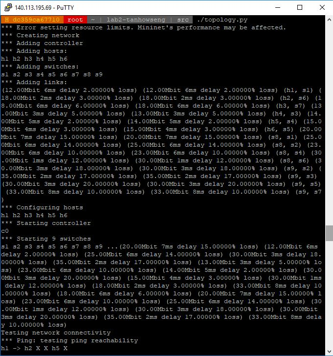
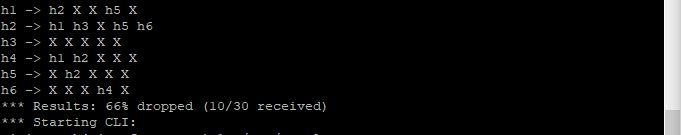
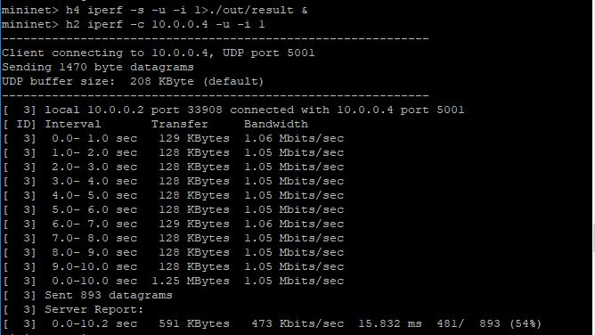

# Network Topology with Mininet

This repository is lab for NCTU course "Introduction to Computer Networks 2018".

---
## Abstract

In this lab, we are going to write a Python program which can generate a network topology using Mininet and use iPerf to measure the bandwidth of the topology.

---
## Objectives

1. Learn how to create a network topology with Mininet
2. Learn how to measure the bandwidth in your network topology with iPerf

---
## Execution

> TODO: 
> * Describe how to execute your program
> * Show the screenshot of using iPerf command in Mininet

### topology.py

1. Simply run the python file using the command: ./typology.py

2. To check if the topology is correct, use the iPerf command to measure the network and produce the measurement results. Compare the results with the expected results given.

---
## Description

### Mininet API in Python

> TODO:
> * Describe the meaning of Mininet API in Python you used in detail

1. Mininet is a network emulator. It creates a realistic virtual network, running real kernel, switch and application code, om a single machine (VM, cloud or native). It tuns a collection of end-hosts, switches, routers, and links on a single LInux kernel. 

### iPerf Commands

> TODO:
> * Describe the meaning of iPerf command you used in detail

1. iPerf is a tool for active measurements of the maximum acheiveable bandwidth on IP networks. It supports tuning of various parameters related to timing, buffers and protocols (TCP, UDP, SCTP with IPv4 and IPV6)

### Tasks

> TODO:
> * Describe how you finish this work step-by-step in detail

1. **Environment Setup** 
Step 1:  
I clicked the link provided to obtain the files required for the lab. 
Step 2: 
I used Putty(instead of Pietty) to login to my linux container through ssh.  
Step 3: 
I proceeded to clone my github files using the following command in Putty: 
>> $ git clone https://github.com/nctucn/lab2-<GITHUB_ID>.git Network_Topology  
Step 4: 
After logging in to my container, I ran Mininet for testing. 
>> $ sudo service openvswitch-sitch start
>> $ sudo mn

2. **Example of Mininet**

3. **Topology Generator**

4. **Measurement**

---
## References

> TODO: 
> * Please add your references in the following

* **Mininet**
    * [Mininet Walkthrough](http://mininet.org/walkthrough/)
    * [Introduction to Mininet](https://github.com/mininet/mininet/wiki/Introduction-to-Mininet)
    * [Mininet Python API Reference Manual](http://mininet.org/api/annotated.html)
    * [A Beginner's Guide to Mininet](https://opensourceforu.com/2017/04/beginners-guide-mininet/)
    * [GitHub/OSE-Lab - 熟悉如何使用 Mininet](https://github.com/OSE-Lab/Learning-SDN/blob/master/Mininet/README.md)
    * [菸酒生的記事本 – Mininet 筆記](https://blog.laszlo.tw/?p=81)
    * [Hwchiu Learning Note – 手把手打造仿 mininet 網路](https://hwchiu.com/setup-mininet-like-environment.html)
    * [阿寬的實驗室 – Mininet 指令介紹](https://ting-kuan.blog/2017/11/09/%E3%80%90mininet%E6%8C%87%E4%BB%A4%E4%BB%8B%E7%B4%B9%E3%80%91/)
    * [Mininet 學習指南](https://www.sdnlab.com/11495.html)
* **Python**
    * [Python 2.7.15 Standard Library](https://docs.python.org/2/library/index.html)
    * [Python Tutorial - Tutorialspoint](https://www.tutorialspoint.com/python/)
* **Others**
    * [iPerf3 User Documentation](https://iperf.fr/iperf-doc.php#3doc)
    * [Cheat Sheet of Markdown Syntax](https://www.markdownguide.org/cheat-sheet)
    * [Vim Tutorial – Tutorialspoint](https://www.tutorialspoint.com/vim/index.htm)
    * [鳥哥的 Linux 私房菜 – 第九章、vim 程式編輯器](http://linux.vbird.org/linux_basic/0310vi.php)

---
## Contributors

> TODO:
> * Please replace "YOUR_NAME" and "YOUR_GITHUB_LINK" into yours

* [YOUR_NAME](YOUR_GITHUB_LINK)
* [David Lu](https://github.com/yungshenglu)

---
## License

GNU GENERAL PUBLIC LICENSE Version 3
